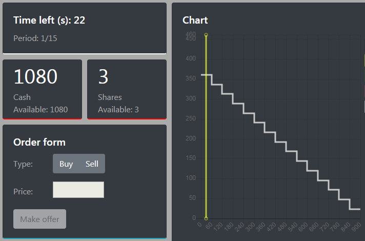

## Getting started
Download for your system, unzip and run.

Latest version (2019.12.10): **0.8.4**

<a href='https://github.com/opowell/jtree/releases/latest/download/jtree-0.8.4-win.zip'>jtree for Windows</a>

<a href='https://github.com/opowell/jtree/releases/latest/download/jtree-0.8.4-macos.zip'>jtree for Mac</a>

<a href='https://github.com/opowell/jtree/releases/latest/download/jtree-0.8.4-linux.zip'>jtree for Linux</a>

<a href='https://github.com/opowell/jtree/releases/latest/download/jtree-0.8.4-winxp.zip'>jtree for WindowsXP</a>

#### Features
- functions, objects.
- subjects not required to run separate program / use Windows.
- server runs natively on Windows, MacOS and Linux.
- autoplay for testing.
- treatment options: facilitate switching between important parameter configurations of a treatment.
- session queues: save sequences of treatments (including their options) for re-use.

#### <a href='https://opowell.github.io/jtree/reference/tutorial-1-quick-start.html'>Quick start</a>

#### <a href='https://opowell.github.io/jtree/reference/tutorial-2-setup.html'>Setup</a>

#### <a href='https://opowell.github.io/jtree/reference/tutorial-3-running-a-session.html'>Running a session</a>

#### <a href='https://opowell.github.io/jtree/reference/tutorial-4-designing-an-app.html'>Designing an app</a>

#### <a href='https://opowell.github.io/jtree/reference/tutorial-7-release-notes.html'>Release notes</a>

#### <a href='https://opowell.github.io/jtree/reference/index.html'>Reference</a>

<a href='https://opowell.github.io/jtree'>opowell.github.io/jtree</a>
