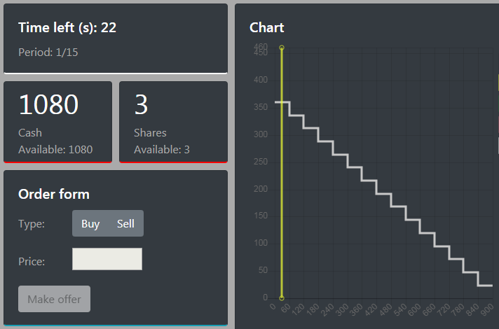

## Getting started
Download the archive for your computer, unpack it, and run the launcher in the unpacked folder. Node.js is included; nothing else needs installing.

| Download | Then run |
| --- | --- |
| <a href='https://github.com/opowell/jtree/releases/latest/download/jtree-win-x64.zip'>Windows</a> | `start.cmd` |
| <a href='https://github.com/opowell/jtree/releases/latest/download/jtree-darwin-arm64.tar.gz'>macOS, Apple Silicon (M1 and later)</a> | `start.command` |
| <a href='https://github.com/opowell/jtree/releases/latest/download/jtree-darwin-x64.tar.gz'>macOS, Intel</a> | `start.command` |
| <a href='https://github.com/opowell/jtree/releases/latest/download/jtree-linux-x64.tar.gz'>Linux, x86-64</a> | `start.sh` |
| <a href='https://github.com/opowell/jtree/releases/latest/download/jtree-linux-arm64.tar.gz'>Linux, ARM64</a> | `start.sh` |
| <a href='https://github.com/opowell/jtree/releases/latest/download/jtree-portable.zip'>Any system with Node.js 22+</a> | `start.sh` or `start.cmd` |

The admin page opens in your browser, at http://localhost:3000/jtree/admin/. Participants open the address jtree prints (`http://<this computer's address>:3000/jtree/`). On macOS, the first time, right-click `start.command`, choose Open, and confirm. Set `PORT` to use another port.

Older versions (0.8.7 and before) are on the [releases page](https://github.com/opowell/jtree/releases).

#### Admin access
With no admin password set, the admin interface only opens on the computer running jtree. To use it from other computers, set a password in `client/settings.json` (create the file if it is not there), then restart jtree:

```json
{ "defaultAdminPwd": "choose-a-password" }
```

Everyone then logs in at `/jtree/admin/login`, on this computer too.




#### Features
- functions, objects.
- subjects not required to run separate program / use Windows.
- server runs natively on Windows, MacOS and Linux.
- autoplay for testing.
- treatment options: facilitate switching between important parameter configurations of a treatment.
- session queues: save sequences of treatments (including their options) for re-use.

#### <a href='https://opowell.github.io/jtree/reference/tutorial-1-quick-start.html'>Quick start</a>

#### <a href='https://opowell.github.io/jtree/reference/tutorial-2-setup.html'>Setup</a>

#### <a href='https://opowell.github.io/jtree/reference/tutorial-3-running-a-session.html'>Running a session</a>

#### <a href='https://opowell.github.io/jtree/reference/tutorial-4-designing-an-app.html'>Designing an app</a>

#### <a href='https://opowell.github.io/jtree/reference/tutorial-7-release-notes.html'>Release notes</a>

#### <a href='https://opowell.github.io/jtree/reference/index.html'>Reference</a>

<a href='https://opowell.github.io/jtree'>opowell.github.io/jtree</a>

#### USER EXPERIMENTS
<a href='https://www.github.com/opowell/1natalia'>1natalia (University of Vienna, Ural Federal University)</a><br>
<a href='https://www.github.com/opowell/2peter'>2peter (Vienna University of Economics and Business)</a><br>
<a href='https://www.github.com/opowell/3james'>3james (University of Vienna, Vienna University of Economics and Business)</a><br>
<a href='https://www.github.com/opowell/5mariana'>5mariana (Vienna University of Economics and Business)</a><br>
<a href='https://www.github.com/opowell/6maxtom'>6maxtom (Vienna University of Economics and Business)</a><br>
<a href='https://www.github.com/opowell/7simone'>7simone (Vienna University of Economics and Business)</a><br>
<a href='https://www.github.com/opowell/8jelena'>8jelena (Vienna University of Economics and Business)</a><br>
<a href='https://www.github.com/opowell/9natalia'>9natalia (University of Vienna)</a><br>
<a href='https://www.github.com/opowell/10ali'>10ali (Vienna University of Economics and Business)</a><br>
<a href='https://www.github.com/opowell/11simone'>11simone (Vienna University of Economics and Business)</a><br>

#### Run with JAS
jtree runs as an app on [JAS](https://github.com/opowell/jas), which is included as a submodule in `vendor/jas`. You need [Node.js](https://nodejs.org) 22 or later and git.

```sh
git clone --recurse-submodules https://github.com/opowell/jtree.git
cd jtree
./start.sh          # macOS, Linux
start.cmd           REM Windows
```

Open http://localhost:3000/jtree/admin. Set `PORT` to use a different port. On the first run the launcher fetches the submodule if it is missing, and installs the server dependencies (`server/node_modules`) with pnpm, or npm if pnpm is not installed.

| Path | What it is |
| --- | --- |
| `apps/jtree/` | The JAS app: `server.js` starts jtree's server (`server/source/jtree.js`) on the server JAS owns, with `client/` as its data folder |
| `vendor/jas/` | JAS (submodule) |
| `start.sh`, `start.command`, `start.cmd` | Run JAS on this repo's `apps/` folder |
| `client/internal/clients/admin/v2/` | The admin interface (admin2), served at `/jtree/admin/` with no build step. The older one is at `/jtree/admin/multiuser/`. |

Everything jtree serves is under one route, `/jtree` by default: the admin (`/jtree/admin`), participant links (`/jtree/P1`, `/jtree/session/<id>/P1`), shared files and socket.io (`/jtree/socket.io`). HTML pages, experiment apps' stages included, are written with root-absolute URLs (`src="/shared/..."`), and jtree rewrites them to that route as it serves them. So jtree can sit beside other apps in any JAS:

```sh
ln -s "$PWD/apps/jtree" /path/to/jas/apps/jtree
```

Link it rather than copy it, since `server.js` loads jtree from this repo. Restart that JAS afterwards, because JAS loads an app's `server.js` only at startup. This needs a JAS with per-app routes; an older one serves it at `/<folder name>` anyway.

To change the route, set `route` in [apps/jtree/settings.json](apps/jtree/settings.json), e.g. `"route": "/lab"`. Running jtree without JAS (see Development below), set `basePath` in `client/settings.json` instead; it defaults to `/jtree`, and `""` serves jtree at the root as before.

#### Development
1. Clone the project (see Run with JAS above).
2. Install server files.
   1. cd server
   2. pnpm i
3. Start the server, without JAS
   1. cd client
   2. node ../server/source/jtree.js
4. Admin interface: edit the files in `client/internal/clients/admin/v2/` and reload the page; there is no build step. See [its README](client/internal/clients/admin/v2/README.md).

#### Releasing
1. Set the version in [server/package.json](server/package.json) and commit.
2. Push a tag `v<version>`, e.g. `git tag v0.9.0 && git push origin v0.9.0`. [.github/workflows/release.yml](.github/workflows/release.yml) builds the archives and publishes the release.

To build the archives locally (needs git, pnpm, zip, tar and an internet connection): `node build-tools/build-release.mjs`, or `--targets darwin-arm64` for one platform. They go to `dist/`.
